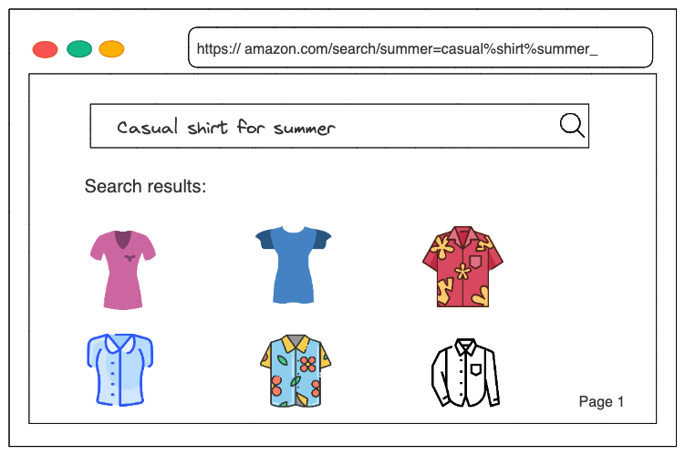
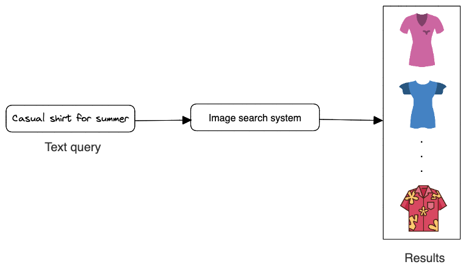
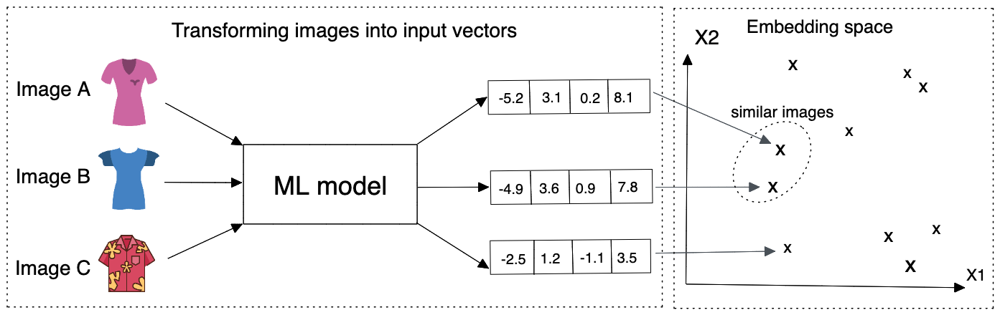

<!-- ---
title: 'Designing a Recommendation System for Search in E-Commerce'
author: babaniyi
comments: true
date: 2023-03-11

tags:
- Data Science
- ML System design
- Search

* Basic intro
The number of products available on ecommerce platforms like Amazon, Alibaba, Ebay can be huge and can grow into hundred of thousands if not millions. For instance, on Amazon a user may input **casual shirt for summer**, then a list of shirts that are available are returned to the user. In simple terms, what happens in the background is that, a system has been put in place that retrieves images similar to the user's query, ranks them based on the similarities to the query and then displays them to the user. 

The system that does this hardlifting is my focus in this article, that is, I explain how to design a product search system similar to the one used by leading e-commerce platforms that takes a user's text query and returns a list of images that are relevant to the text query.

--- -->
On e-commerce sites like Amazon, there may be millions of different products to choose from. For instance, a customer on Amazon could type in *"casual shirt for summer"* and receive a list of available shirts. A system has been set up in the background that retrieves images related to the user's query, ranks them according to their similarity to the query, and then shows them to the user.

In this post, I describe how to create a search system that works in a manner similar to that of e-commerce platforms by taking a user's text query and returning a list of relevant product images.


<figure>
    <center>
    
    </center>
    <figcaption><center> Figure 1.1: Searching images with a text query </center></figcaption>
</figure>

## Basic requirements
To summarize the problem statement, we are designing an image search system that retrieves images similar to the user query, ranks them based on their similarities to the text query, and then displays them to the user. For simplicity, we make some basic assumptions which includes:

1. A user can only input text queries (images or videos queries are not allowed).
1. We do not need to personalize the result of the search system. 
1. We have a dataset of say one million `<image, text query>` pairs for model training. 
1. The model uses image metadata and pixels. Also, users can only click on an image and we can construct training data online and label them based on user interactions.


# 1. Overview of the search system
As shown in Figure 1.2 below, the search system takes a text query as input and outputs a ranked list of images sorted by their relevance to the text query.

<figure>
    <center>
    
    </center>
    <figcaption><center> Figure 1.2: Image search system's input-output </center></figcaption>
</figure>

This kind of problem is known as a ranking problem. In general, the goal of ranking problems is to rank a collection of items such as images, websites, products, etc., based on their relevance to a query, so that more relevant items appear higher in the search results. Many ML applications, such as recommendation systems, search engines, document retrieval, and online advertising, can be framed as ranking problems. 

In order to determine the relevance between an image and a text query, we utilize both image visual content and the image's textual data. An overview of the design can be seen in Figure 1.3.

<figure>
    <center>
    
    </center>
    <figcaption><center> Figure 1.3: High-level overview of the search system </center></figcaption>
</figure>


## 1.1 Text search
Images that have titles, descriptions, or tags that are the most comparable to the text query are displayed as the results of the **text search**. When a user enters in a text query like *casual shirts for summer*, Figure 1.4 demonstrates how text search functions. Using full-text search in a database is one method to find the image description that matches the text query the most.

Full-text search (FTS) is the process of searching a portion of text within a large collection of electronically recorded text data and providing results that include part or all of the terms in the search [[2]](#references). It retrieves documents that don’t perfectly match the search criteria. Documents here refers to database entities containing textual data. 

You may enhance a FTS with search tools like fuzzy-text and synonyms in addition to looking for specific keywords. As a result, while searching with a phrase like "pasta," the results could also include "Fettuccine Carbonara" or "Bacon and pesto flatbread" in addition to dishes like "Pasta with meatballs". This implies that, for example, if a user searches for "cats and dogs," an application supported by FTS may be able to return results that include simply "cats" or "dogs," the words in a different order ("dogs and cats," or "cat"), or alternative spellings of the terms ("dog," or "cat") [[3]](#references). Applications can better infer the user's intent thanks to this, which speeds up the return of relevant results.
This technique is not based on machine-learning hence it is fast as there's no training cost involved. Many search engine companies use search engines such as Elasticsearch [[4]](#references), MongoDB Atlas Search [[2]](#references) to return the results of text queries similar to the  catalog queries as seen in Figure 1.4.


<figure>
    <center>
    
    </center>
    <figcaption><center> Figure 1.4: Text search </center></figcaption>
</figure>


## 1.2. Image visual search
This component outputs a list of images after receiving a text query as input. Based on how closely the text query and the image resemble each other, the images are ranked. **Representation learning** is a method that is frequently used to do this.

In representation learning, a model is trained to turn data like images and texts into representations referred to as embeddings. Another way to describe it is that the model converts the images and text queries into points in the embedding space, an N-dimensional space. These embeddings are trained so that nearby embeddings in the embedding space exist for similar images [[1]](#references). 

The text query and image are encoded individually using two encoders in this method. This is significant because words and images must be translated into numerical representations that computers can understand, known as "embeddings," since computers only comprehend numerical data. In order to create an embedding vector for all of the images of the products that are currently accessible, we first apply a machine learning model to encode the images. Figure 1.5 illustrates how similar images are mapped onto two points in close proximity within the embedding space. The text encoder we employ creates an embedding vector from the text after that. Lastly, we use a dot product of their representation to determine the similarity score between the image and text embedding.

<figure>
    <center>
    
    </center>
    <figcaption><center> Figure 1.5: Similar images in the embedding space </center></figcaption>
</figure>

We compute the dot product between the text and each image in the embedding space, then rank the images according to their similarity scores in order to determine which images are most visually and semantically comparable to the text query.

<figure>
     <center>
        
    </center>
        <figcaption> <center>Figure 1.6: ML model's input-output </center></figcaption>
</figure>


# 2. Data Preparation for Training

## 2.1. Data engineering
We assume we are given an annotated dataset to train and evaluate the model. We could have users, image and user-image interactions data. 

### 2.1.1. Images
The system stores catalog items and their metadata. Table 1.1 shows a simplified example of image metadata

| Image ID    | Upload time |  Manual tags|
| ----------- | ----------- | -----------|  
| 10          | 105743135 | cotton, polo
| 193          | 1958351341 | long-sleeve, flannel, polyester
Table 1.1: Image metadata 


### 2.1.2. User-image interactions data
Many kinds of user interactions are contained in interaction data. The type of queries users enter and their interactions with it may be revealed by this kind of data. Clicks, impressions, and purchases (conversion, add-to-cart, etc.) are the three main sorts of interactions, albeit they could be noisy. Table 1.2 displays a condensed example of user-image interaction metadata; we shall discuss this further.


|  User ID      | Text query |  Displayed image ID | Interaction type | Timestamp |
| -----------   | -----------    | -----------     |    -----------   | ----------- |
| 10            | White cotton polo |  9   | Click | 1658451365 
| 193           | Men's long sleeve summer flannel shirt |  15  | Click | 1648452360 
| 104           | Women blouse perfect for winter|  7543  | Purchase | 1748452261
| 1345          |Children christmas wear for winter with red cap |  15  | Click | 1848451367
<center> Table 1.2: User-image interaction data </center>


## 2.2 Feature engineering
Nearly all algorithms for machine learning only accept numeric input values. During this step, unstructured data like texts and images must be transformed into a numerical representation. We outline the process for getting the text and image data ready for the model.

### 2.1. Preparing the text data
As shown in Figure 1.7, text is typically represented asa numerical vector using three steps: text tokenization, text normalisation and token to IDs [[5]](#references)

<figure>
     <center>
        
    </center>
        <figcaption> <center>Figure 1.7: Represent a text with a numerical vector </center></figcaption>
</figure>


#### **Text normalisation**
Tokens are a basic meaningful unit of a sentence or a document. They can consist of words, phrases, subwords, or characters 
Normalization is the process of converting a token into its base form. It is helpful in reducing the number of unique tokens present in the text, removing the variations in a text and cleaning it by removing redundant information. Basic methods for text normalization includes: converting all letters to lowercase to retain the meanings of words, trimming whitespaces, remove accent marks, lemmatization and stemming, removing punction marks, etc.


#### **Tokenization**
Tokenization is breaking the raw text into small chunks. Tokenization breaks the raw text into words, sentences called tokens. Tokenization helps in interpreting the meaning of the text by analyzing the sequence of the words. For example, the text *"Brown chelsea leather boots perfect for winter"* can be tokenized to *["Brown", "chelsea", "leather", "boots", "perfect", "for", "winter"]*. If the text is split into words using some separation technique it is called *word tokenization* and same separation done for sentences is called *sentence tokenization*. There are various tokenization techniques available which can be applicable based on the language and purpose of modeling, they include:

- **Subword tokenization:** This process split text into subwords (n-gram characters). In this method, the most often used words are assigned distinctive identifiers, and the less frequently used terms are divided into smaller words that best express the meaning on their own. As an illustration, if the word *"dark"* occurs frequently in a text, it will be given a unique ID, but the terms *"darker"* and *"darkest"*, which are uncommon and appear less frequently in a text, will be divided into subwords such as "dark", "er", and "est". This aids in preventing the language model from learning "darker" and "darkest" as two distinct terms and enables the training process to detect the unknown words in the data set. There are various kinds of subword tokenization, including Byte-Pair Encoding (BPE), WordPiece, Unigram Language Model, SentencePiece.

- **White Space Tokenization:** In this process entire text is split into words by splitting them from whitespaces. This is the fastest tokenization technique but works only for languages like English in which the white space breaks apart the sentence into meaningful words.

- **Dictionary Based Tokenization:** In this method the tokens are found based on the tokens already existing in the dictionary. If the token is not found, then special rules are used to tokenize it. It is an advanced technique compared to whitespace tokenizer.

- **Rule Based Tokenization:** In this technique, a set of rules are created for the specific problem. The tokenization is done based on the rules. For example creating rules bases on grammar for particular language.


#### **Tokens to IDs mapping**
Once we have tokens, we need to convert them to numerical values. This can done using Lookup table or hashing.

- **Lookup table:** In this method, each unique token is mapped to an ID. Next, a lookup table is created to store these 1:1 mappings. Lookup tables has its strengths which includes speed as it is easy to convert tokens to IDs and also convert the IDs back to tokens using a reverse index table. However, downside is that it stores the table in a memory hence having a large number of tokens requires huge memory space. Also, it cannot handle new or unseen words properly.

- **Hashing:** Compared to lookup tables, hashing also known as "feature hashing", or "hashing trick" is a memory efficient method that uses hash function to obtain IDs, without keeping a lookup table. We know that as models are trained with corpus with larger sizes, it produces vocabularies that take more and more memory space to store [[6]](#references). For efficiency purposes, these lookup tables are stored in RAM for quick token-id mapping and can slow down the operations once their size gets too big. By using a hashing, we can get rid of such memory-consuming vocabularies entirely and a hash function is used for token-id mapping instead. With a given string, a hash function is capable of returning a numerical value, a hash value, that’s unique to that string and use it as token id. Since there’s no fix-sized vocabulary involved, all tokens can now be assigned to a number, no matter the model has seen it before or not [[6]](#references). The downside is that after hashing, we cannot convert IDs back to tokens.


## 2.2 Preparing image data
In the earlier section [1](#1-overview-of-the-search-system), we explained the goal is to design an image search system that retrieves images similar a user's text query, rank them based on their similarities to the text query, and then display them to the user. Since the model returns an image as output, we need to preprocess catalod images. The most common image preprocessing operations are [[1]](#references):

- **Resizing:** Models usally require fixed image sizes (e.g. $224 * 224$)
- **Scaling:** Scale pixel values of each image to be in the range of 0 and 1
- **Z-score standardization:** Scale pixel values to have a mean of 0 and variabce of 1
- **Consistent color mode:** Ensure images have a consistent color mode (e.g. RGB or CMYK)


# 3. Model Development

## 3.1. Embedding Model Selection
As discussed in the [Overview of the search system](#1-overview-of-the-search-system) and visualised in [Figure 1.6](#12-image-visual-search), text queries are converted into emebeddings by a text encoder, and images are converted  into embeddings by an image encoder. In this section, we examine possible model architectures for each encoder.


### 3.1.1 Text encoder
A typical text encoder's input and output are shown in Figure 1.8.

<figure>
     <center>
        
    </center>
        <figcaption> <center>Figure 1.8: Text encoder's input-output </center></figcaption>
</figure>

The text encoder converts text into a vector representation. For example, if two separate sentencs have similar meanings, their embeddings are mote similar. To build the text encoder, two broad categories are widely available: *statistical methods* and *machine learning based methods*. 

### **Statistical methods**
These methods rely on statistics to convert meaningful text into number (vector) representation. Three popular methods are:
- Index-Based Encoding
- Bag of Words (BoW)
- Term Frequency Inverse Document Frequency (TF-IDF)

**Index-Based Encoding**. 
As the name implies requires all the unique words in a document, then it assigns an index. For instance, suppose we have the following 3 sentences namely *["Men's long-sleeve summer flannel shirt", "White cotton polo", "Women blouse perfect for winter"]*. Then our corpus (collection of unique words in a document) would look like this *["men", "long-sleeve", "summer", "flannel", "shirt", "white", "cotton", "polo", "women", "blouse", "perfect", "for", "winter"]*

Then we assign an index to each word like: "men": 1, "cotton": 2, "summer":3, "white": 4, "polo": 5 and so on. Now that we have assigned a unique index to all the words so that based on the index we can uniquely identify them and replace the words in each sentence with their respective indexes. The text query *"White cotton polo"* becomes [4, 2, 5] which is understandable to any machine.

But there is an issue which needs to be addressed first and that is the consistency of the input. Our input needs to be of the same length as our model, it cannot vary. It might vary in the real world but needs to be taken care of when we are using it as input to our model.

Now as we can see the first sentence (*"Men's long-sleeve summer flannel shirt"*) has $5$ words, but the next sentence (*"White cotton polo"*) has $3$ words, this will cause an imbalance in our model. To overcome this, we use max padding, which means we take the longest sentence from our document corpus and we pad the other sentence to be as long. This means if all of my sentences are of $5$ words and one sentence is of $3$ words, we will make all the sentences of $5$ words.

To add the extra word, recall while assigning indexes we started from $1$ not $0$. We use $0$ as our padding index. This also means that we are appending nothing to our actual sentence as 0 doesn’t represent any specific word, hence the integrity of our sentences are intact

**Bag of Words (BoW)**. BoW is another form of encoding where we use the whole data corpus to encode our sentences. BoW models sentence-word occurreences by creating a matrix with rows representing senetences and columns representing word appearance or frequencies.

Suppose, our data corpus consist of the following:

<center>["men", "long-sleeve", "summer", "flannel", "shirt", "white", "cotton", "polo", "women", "blouse", "perfect", "for", "winter"] </center>

There are 2 kinds of BoW:
1. Binary BoW: We encode 1 or 0 for each word appearing or non-appearing in the sentence. We do consider the frequency of the word appearing in that sentence.
2. BoW: We consider the frequency of each word occurring in that sentence.

An example of BoW is shown in Table 1.3


|                                           | men | long-sleeve | summer| flannel | shirt | white| cotton | polo| women |blouse | perfect | for | winter |
| --------                                  | --- | --- |---| --- | --- | --- | --- | --- | --- | --- | --- | --- | --- |
| men's long-sleeve summer flannel shirt    | 1| 1| 1| 1 | 1 | 0| 0 | 0| 0 | 0 | 0 | 0 | 0 |
| women white cotton polo shirt             | 0| 0| 0| 0 | 1 | 1| 1 | 1| 1 | 0 | 0 | 0 | 0 |
| for women cotton blouse perfect for winter   | 0| 0| 0| 0 | 0 | 0| 1 | 0| 1 | 1 | 1 | 2 | 1 |
<center> Table 1.3: BoW representatiion of different sentences </center>

BoW is a simple method that computes sentence representations fast, but has the following limitations [[1]](#references):
- It does not consider the order of words in a sentence. For example, *"fitted shirts for tall men"* and *"tall men for fitted shirts"* would have the same BoW representation
- The obtained representation does not capture the semantic and contextual meaning of the sentence. For exampole, two sentences with the same meaning but different words have a totally different represntation.
- The representation vector is sparse. The size of the representation vector is equal to the total number of unique tokens we have. This number is usually large, so each sentem¡nce is mostly filled with zeroes.

**Term Frequency Inverse Document Frequency (TF-IDF)**. In this method, we give every word a relative frequency coding with respect to the current sentence and the whole document [[7]](#references)

Term Frequency: Is the occurrence of the current word in the current sentence with respect to the total number of words in the current sentence.

$$ tf_{ij} = \frac{n_{i,j}}{\sum_{k}n_{i,j}}$$

Inverse Data Frequency: Log of Total number of words in the whole data corpus with respect to the total number of sentences containing the current word.

$$ idf(w) = log \big(\frac{N}{df_{t}}\big)$$

TF-IDF is a numerical statistic intended to reflect how important a word is to a document in a collection or corpus. It creates the same sentence-word matrix like in BoW but it normalizes the matrix based on the frequency of words. Since TF-IDF gives less weight to frequent words, its representations are usually better than BoW. However, it has its drawbacks such as: it does not consider the order of words in a sentence, the obtained representations are sparse and does not even capture the semantic meaning of the sentence.

In summary, statistical methods for text encoding are usually fast however they do not capture the contextual meaning of sentences. ML-based methods which we will discuss next address these issues.


### **ML-based methods**
In these methods, an ML model converts sentences into meaningful word embeddings so that the distance between two embeddings reflects the semantic similarity of the corresponding words. For example, if two words such as "cotton" and "wool", are semantically similar, their embeddings are close in the embedding space.

There are various ML-based approaches for transforming texts into word embeddings, examples include: Word2Vec, GloVe, Transformer-based architectures.

**Word2Vec:** word2vec [[8]](#references) is not a singular algorithm, rather, it is a family of model architectures and optimizations that can be used to learn word embeddings from large datasets. Word2vec is a shallow, two-layer Artificial Neural Network that processes text by converting them into numeric "vectorized" words. It’s input is a large word corpus and output a vector space, usually hundreds of dimensions, with each unique word in the corpus represented with that vector space generated. It is used to reconstruct linguistic contexts of words into numbers. Word vectors are positioned in the vector space in such a way that the words that share common contexts are located in close proximity to one another in that multidimensional space, in layman terms the words that almost mean the same will be placed together.

There are two methods for learning representations of words in word2vec:
- Continuous bag-of-words model: predicts the middle word based on surrounding context words. The context consists of a few words before and after the current (middle) word. This architecture is called a bag-of-words model as the order of words in the context is not important.
- Continuous skip-gram model: predicts words within a certain range before and after the current word in the same sentence. A worked example of this is given below.

We will not explain in detail the other ML-based approaches for transforming texts.


### 3.1.2 Image encoder
For encoding images, we propose using neural networks because it has proven to be good at handling texts and images and able to produce the embeddings needed for representation learning. CNN-based architectures such as Residual network or ResNet [[9]](#references) has an impressive $152$ layers. The key to the model design is the idea of residual blocks that make use of shortcut connections. These are simply connections in the network architecture where the input is kept as-is (not weighted) and passed on to a deeper layer, e.g. skipping the next layer.  

<figure>
     <center>
        
    </center>
        <figcaption> <center>Figure 1.9: An image embedding model </center></figcaption>
</figure>


## 3.2. Model Training
In order to retrieve images similar to the text query, a model must learn representations (embedding) during training. In this section, we discuss how to train the text and image encoder using **contrastive learning** [[10]](#references). In this approach, we train a model to distinguish between similar `<text query, image>` pair from dissimilar ones. In other words, we provide the model with a *<text query, image>* pair, one similar pair , and a few disimilar pair. During training, the model learns to produce representations in which similar text query - image pair resemble the pair, than other pairs.

### **Constructing the dataset**
As described earlier, each data point used for training contains a query-image pair, a positive query-image pair that's similar to the pair, and $n-1$ negative pairs that are dissimilar to the pair. The ground truth label of the data point is thee index of the positive text query-image pair. As Figure 2.0 depicts, along with a query-image pair ($k$), we have $n$ other images of which one is similar to the $k$ (casual men's beach summer shirt) and the other $n-1$ images are dissimilar. The ground truth label for this data point is the index of the positive image, which is $3$ (the third image among the $n$ images in Figure 2.0)

<figure>
     <center>
        
    </center>
        <figcaption> <center>Figure 2.0: Training data point </center></figcaption>
</figure>


To construct a data point, we randomly choose a text query - image pair and $n-1$ negative text queries since our input is the text query. To select a positive image, we have the following three options:

- Use human judgement: Here, we rely on humans manually finding similar search query-image pairs. The advantage is that we have accurate correctly labelled data however it is time-consuming and expensive.
- Use interactions such as user clicks, purchases as proxy for similarity: This approach does not require manual and can generate data automatically when a user interacts (clicks, purchase) an image. We assume similarity is based on interaction dara and the interacted image is similar to the search query. However, interactions data is very noisy as users sometimes click on images even when it is not similar to thee text query. Also, the data is very sparse and these problems in turn leads to poor performance.


## 3.3 Ranking and loss computation
Ranking is a slower—but more precise—step to score and rank top candidates. As we’re processing fewer items (i.e., hundreds instead of millions), we have room to add features that would have been infeasible in the retrieval step (due to compute and latency constraints). Such features include item and user data, and contextual information. We can also use more sophisticated models with more layers and parameters [[11]](#references).

### **Loss function selection**
The goal of the training is to optimize the model parameters so that similar text query - image pairs have embeddings close to each other in the embedding space. Ranking can be modeled as a learning-to-rank or classification task, with the latter being more commonly seen. In this article, we are proposing using deep learning deep learning where the final output layer is a softmax over a catalog of images. We could aslo use a sigmoid predicting the likelihood of user interaction (e.g., click, purchase) for each query-image pair. The loss computation steps can be summarised as follows:

- **Generate embeddings:** Use text and image encoders to generate the embeddings for the search query and catalog images.
- **Compute similarities:** Compute the similarities beetween the text query's embedding and the catalog image embeddings 
- **Softmax function:** This is applied over the computed distances to ensure the values sum up to one, by so doing we can interpret the similarity values as probabilities.
- **Cross-entropy:** Cross-entropy measures how close the predicted probabilities are to the ground trith labels. When the predicted probabilities are close to the ground truthm it shows the embeddings can distinguish the positive query-image pair from the negative ones.

Figure 2.1 visualises the system architecture, we see the model takes text query as input, produces embedding for this query, compute the similarity between this embedding and the embedding of each image in the catalog. There are different measures of similarites we could use and they have their pros and cons, examples include dot product, cosine similarity, euclidean distance among others.

<figure>
     <center>
        
    </center>
        <figcaption> <center>Figure 2.1: Model input-output and loss computation </center></figcaption>
</figure>


# 4. Evaluation


# 


To cite this content, please use:

> Olaniyi, B (Mar 2023). Designing a Recommendation System for Search in E-Commerce. babaniyi.com. https://babaniyi.com/writing/system-design-for-search-ecommerce


```
@article{olaniyi2023system,
  title   = {Designing a Recommendation System for Search in E-Commerce} ,
  author  = {Olaniyi,
  journal = {babaniyi.com},
  year    = {2023},
  month   = {Mar},
  url     = {https://babaniyi.com/writing/system-design-for-search-ecommerce}
}
```

# References
1. Ali Aminian & Alex Xu (2023). *Machine Learning System Design Interview*
2. Full Text Search with MongoDB. https://www.mongodb.com/basics/full-text-search
3. How To Improve Database Searches with Full-Text Search. https://www.digitalocean.com/community/tutorials/how-to-improve-database-searches-with-full-text-search-in-mysql-5-6-on-ubuntu-16-04
4. Elastic Search. https://www.elastic.co/elasticsearch
5. Preprocessing text data. https://huggingface.co/docs/transformers/preprocessing
6. An Overview of Text Representation in NLP. https://towardsdatascience.com/an-overview-for-text-representations-in-nlp-311253730af1
7. NLP text encoding. https://medium.com/analytics-vidhya/nlp-text-encoding-a-beginners-guide-fa332d715854#:~:text=Text%20encoding%20is%20a%20process,out%20the%20context%20of%20sentences.
8. Word2Vec.https://www.tensorflow.org/tutorials/text/word2vec
9. ResNet. https://www.cv-foundation.org/openaccess/content_cvpr_2016/html/He_Deep_Residual_Learning_CVPR_2016_paper.html
10. A Simple Framework for Contrastive Learning of Visual Representations. https://arxiv.org/abs/2002.05709
11. Yan, Ziyou. (Jun 2021). System Design for Recommendations and Search. eugeneyan.com. https://eugeneyan.com/writing/system-design-for-discovery/.