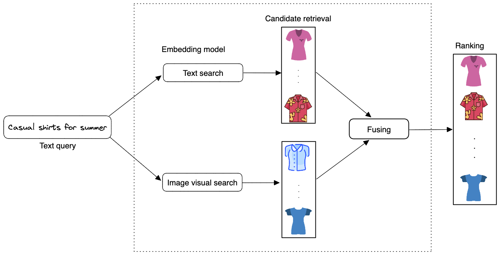

<!-- ---
title: 'Building a Machine Learning-Based Product Search Engine'
author: babaniyi
comments: true
date: 2023-03-11

tags:
- Data Science
- ML System design
- Search

* Basic intro
The number of products available on ecommerce platforms like Amazon, Alibaba, Ebay can be huge and can grow into hundred of thousands if not millions. For instance, on Amazon a user may input **casual shirt for summer**, then a list of shirts that are available are returned to the user. In simple terms, what happens in the background is that, a system has been put in place that retrieves images similar to the user's query, ranks them based on the similarities to the query and then displays them to the user. 

The system that does this hardlifting is my focus in this article, that is, I explain how to design a product search system similar to the one used by leading e-commerce platforms that takes a user's text query and returns a list of images that are relevant to the text query.

--- -->
On e-commerce sites like Amazon, there may be millions of different products to choose from. For instance, a customer on Amazon could type in *"casual shirt for summer"* and receive a list of available shirts. A system has been set up in the background that retrieves images related to the user's query, ranks them according to their similarity to the query, and then shows them to the user.

In this post, I describe how to create a search system that works in a manner similar to that of e-commerce platforms by taking a user's text query and returning a list of relevant product images.

<figure>
    

    
    

    <figcaption>
 Figure 1.1: Searching images with a text query 
</figcaption>
</figure>

## Basic requirements
To summarize the problem statement, we are designing an image search system that retrieves images similar to the user query, ranks them based on their similarities to the text query, and then displays them to the user. For simplicity, we make some basic assumptions which includes:

1. For simplicity, we assume a user can only input text queries (images or videos queries are not allowed).
1. We do not need to personalize the result of the search system. 
1. We have a dataset of say one million `<image, text query>` pairs for model training. 
1. The model uses image metadata and pixels. Also, users can only click on an image and we can construct training data online and label them based on user interactions.

# 1. Overview of the search system
As shown in Figure 1.2 below, the search system takes a text query as input and outputs a ranked list of images sorted by their relevance to the text query.

<figure>
    

    
    

    <figcaption>
 Figure 1.2: Image search system's input-output 
</figcaption>
</figure>

This kind of problem is known as a ranking problem. In general, the goal of ranking problems is to rank a collection of items such as images, websites, products, etc., based on their relevance to a query, so that more relevant items appear higher in the search results. Many ML applications, such as recommendation systems, search engines, document retrieval, and online advertising, can be framed as ranking problems. 

In order to determine the relevance between an image and a text query, we utilize both image visual content and the image's textual data. An overview of the design can be seen in Figure 1.3.

<figure>
    

    
    

    <figcaption>
 Figure 1.3: High-level overview of the search system 
</figcaption>
</figure>

## 1.1 Text search
Images that have titles, descriptions, or tags that are the most comparable to the text query are displayed as the results of the **text search**. When a user enters in a text query like *casual shirts for summer*, Figure 1.4 demonstrates how text search functions. Using full-text search in a database is one method to find the image description that matches the text query the most.

Full-text search (FTS) is the process of searching a portion of text within a large collection of electronically recorded text data and providing results that include part or all of the terms in the search [2]. It retrieves documents that don’t perfectly match the search criteria. Documents here refers to database entities containing textual data. 

You may enhance a FTS with search tools like fuzzy-text and synonyms in addition to looking for specific keywords. As a result, while searching with a phrase like "pasta," the results could also include "Fettuccine Carbonara" or "Bacon and pesto flatbread" in addition to dishes like "Pasta with meatballs". This implies that, for example, if a user searches for "cats and dogs," an application supported by FTS may be able to return results that include simply "cats" or "dogs," the words in a different order ("dogs and cats," or "cat"), or alternative spellings of the terms ("dog," or "cat") [3]. Applications can better infer the user's intent thanks to this, which speeds up the return of relevant results.
This technique is not based on machine-learning hence it is fast as there's no training cost involved. Many search engine companies use search engines such as Elasticsearch[4], MongoDB Atlas Search[2] to return the results of text queries similar to those you have available as seen in Figure 1.4.

<figure>
    

    
    

    <figcaption>
 Figure 1.4: Text search 
</figcaption>
</figure>

## 1.2. Image visual search
This component outputs a list of images after receiving a text query as input. Based on how closely the text query and the image resemble each other, the images are ranked. **Representation learning** is a method that is frequently used to do this.

In representation learning, a model is trained to turn data like images and texts into representations referred to as embeddings. Another way to describe it is that the model converts the images and text queries into points in the embedding space, an N-dimensional space. These embeddings are trained so that nearby embeddings in the embedding space exist for similar images [1]. 

The text query and image are encoded individually using two encoders in this method. This is significant because words and images must be translated into numerical representations that computers can understand, known as "embeddings," since computers only comprehend numerical data. In order to create an embedding vector for all of the images of the products that are currently accessible, we first apply a machine learning model to encode the images. Figure 1.5 illustrates how similar images are mapped onto two points in close proximity within the embedding space. The text encoder we employ creates an embedding vector from the text after that. Lastly, we use a dot product of their representation to determine the similarity score between the image and text embedding.

<figure>
    

    
    

    <figcaption>
 Figure 1.5: Similar images in the embedding space 
</figcaption>
</figure>

We compute the dot product between the text and each image in the embedding space, then rank the images according to their similarity scores in order to determine which images are most visually and semantically comparable to the text query.

<figure>
     

        
    

        <figcaption> 
Figure 1.6: ML model's input-output 
</figcaption>
</figure>

# 2. Data Preparation for Training

## 2.1. Data engineering
We assume we are given an annotated dataset to train and evaluate the model. We could have users, image and user-image interactions data. 

### 2.1.1. Images
The system stores images of products currently in-stock or available and their metadata. Table 1.1 shows a simplified example of image metadata

| Image ID    | Upload time |  Manual tags|
| ----------- | ----------- | -----------|  
| 10          | 105743135 | cotton, polo
| 193          | 1958351341 | long-sleeve, flannel, polyester
Table 1.1: Image metadata 

### 2.1.2. User-image interactions data
Many kinds of user interactions are contained in interaction data. The type of queries users enter and their interactions with it may be revealed by this kind of data. Clicks, impressions, and purchases (conversion, add-to-cart, etc.) are the three main sorts of interactions, albeit they could be noisy. Table 1.2 displays a condensed example of user-image interaction metadata; we shall discuss this further.

|  User ID      | Text query |  Displayed image ID | Interaction type | Timestamp |
| -----------   | -----------    | -----------     |    -----------   | ----------- |
| 10            | White cotton polo |  9   | Click | 1658451365 
| 193           | Men's long sleeve summer flannel shirt |  15  | Click | 1648452360 
| 104           | Women blouse perfect for winter|  7543  | Purchase | 1748452261
| 1345          |Children christmas wear for winter with red cap |  15  | Click | 1848451367

 Table 1.2: User-image interaction data 

## 2.2 Feature engineering
Nearly all algorithms for machine learning only accept numeric input values. During this step, unstructured data like texts and images must be transformed into a numerical representation. We outline the process for getting the text and image data ready for the model.

### 2.1. Preparing the text data
As shown in Figure 1.7, text is typically represented asa numerical vector using three steps: text tokenization, text normalisation and token to IDs [5]

<figure>
     

        
    

        <figcaption> 
Figure 1.7: Represent a text with a numerical vector 
</figcaption>
</figure>

#### **Text normalisation**
Tokens are a basic meaningful unit of a sentence or a document. They can consist of words, phrases, subwords, or characters 
Normalization is the process of converting a token into its base form. It is helpful in reducing the number of unique tokens present in the text, removing the variations in a text and cleaning it by removing redundant information. Basic methods for text normalization includes: converting all letters to lowercase to retain the meanings of words, trimming whitespaces, remove accent marks, lemmatization and stemming, removing punction marks, etc.

#### **Tokenization**
Tokenization is breaking the raw text into small chunks. Tokenization breaks the raw text into words, sentences called tokens. Tokenization helps in interpreting the meaning of the text by analyzing the sequence of the words. For example, the text *"Brown chelsea leather boots perfect for winter"* can be tokenized to *["Brown", "chelsea", "leather", "boots", "perfect", "for", "winter"]*. If the text is split into words using some separation technique it is called *word tokenization* and same separation done for sentences is called *sentence tokenization*. There are various tokenization techniques available which can be applicable based on the language and purpose of modeling, they include:

- **Subword tokenization:** This process split text into subwords (n-gram characters). In this method, the most often used words are assigned distinctive identifiers, and the less frequently used terms are divided into smaller words that best express the meaning on their own. As an illustration, if the word *"dark"* occurs frequently in a text, it will be given a unique ID, but the terms *"darker"* and *"darkest"*, which are uncommon and appear less frequently in a text, will be divided into subwords such as "dark", "er", and "est". This aids in preventing the language model from learning "darker" and "darkest" as two distinct terms and enables the training process to detect the unknown words in the data set. There are various kinds of subword tokenization, including Byte-Pair Encoding (BPE), WordPiece, Unigram Language Model, SentencePiece.

- **White Space Tokenization:** In this process entire text is split into words by splitting them from whitespaces. This is the fastest tokenization technique but works only for languages like English in which the white space breaks apart the sentence into meaningful words.

- **Dictionary Based Tokenization:** In this method the tokens are found based on the tokens already existing in the dictionary. If the token is not found, then special rules are used to tokenize it. It is an advanced technique compared to whitespace tokenizer.

- **Rule Based Tokenization:** In this technique, a set of rules are created for the specific problem. The tokenization is done based on the rules. For example creating rules bases on grammar for particular language.

#### **Tokens to IDs mapping**
Once we have tokens, we need to convert them to numerical values. This can done using Lookup table or hashing.

- **Lookup table:** In this method, each unique token is mapped to an ID. Next, a lookup table is created to store these 1:1 mappings. Lookup tables has its strengths which includes speed as it is easy to convert tokens to IDs and also convert the IDs back to tokens using a reverse index table. However, downside is that it stores the table in a memory hence having a large number of tokens requires huge memory space. Also, it cannot handle neew or unseen words properly.

- **Hashing:** Compared to lookup tables, hashing also known as "feature hashing", or "hashing trick" is a memomery efficient method that uses hash function to obtain IDs, without keeping a lookup table. We know that as models are trained with corpus with larger sizes, it produces vocabularies that take more and more memory space to store. For efficiency purposes, these lookup tables are stored in RAM for quick token-id mapping and can slow down the operations once their size gets too big. By using a hashing, we can get rid of such memory-consuming vocabularies entirely and a hash function is used for token-id mapping instead. With a given string, a hash function is capable of returning a numerical value, a hash value, that’s unique to that string and use it as token id. Since there’s no fix-sized vocabulary involved, all tokens can now be assigned to a number, no matter the model has seen it before or not. The downside is that after hashing, we cannot convert IDs back to tokens.

## 2.2 Preparing image data

# References
1. Ali Aminian & Alex Xu (2023). *Machine Learning System Design Interview*
2. Full Text Search with MongoDB. https://www.mongodb.com/basics/full-text-search
3. How To Improve Database Searches with Full-Text Search. https://www.digitalocean.com/community/tutorials/how-to-improve-database-searches-with-full-text-search-in-mysql-5-6-on-ubuntu-16-04
4. Elastic Search. https://www.elastic.co/elasticsearch
5. Preprocessing text data. https://huggingface.co/docs/transformers/preprocessing
